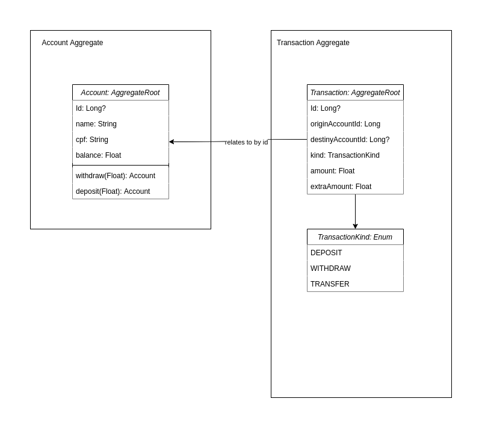

# ZBank Account Application

A digital bank developed in Kotlin + Spring Boot

## Domain Model


## Requirements

* Intellij IDEA
* Docker

## Running

* Start the containers, running on the project path

```shell script
$ docker-compose up -d
``` 

* Access your API at http://localhost:8080
* You could find a Swagger with all the endpoints on http://localhost:8080/swagger-ui/
 
## Developing
 
 * Start the database containers, running on the project path (it could take a few minutes to build)
 
 ```shell script
 $ docker-compose -f docker-compose.development.yml up -d
 ``` 
 
* Open the project on your Intellij IDEA
* Import the gradle configuration
* Select BankAccountApplicationKt on `Edit run/debug configurations` dialog
* Run the application

## Testing

* Right-click at the root project tree and select `Run Tests in account`

## Postman Collection

You could find examples of requests here:

### Attention

All the api requests except for `POST /account` must be authenticated with `Basic(accountId:cpf)`  


